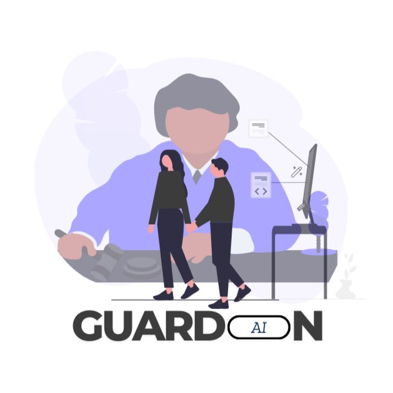
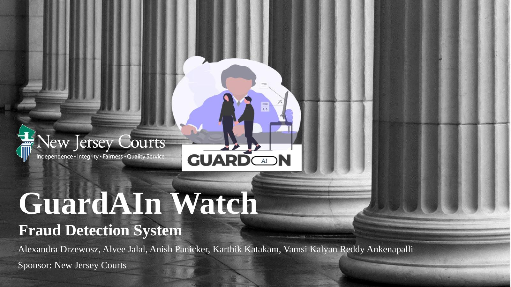
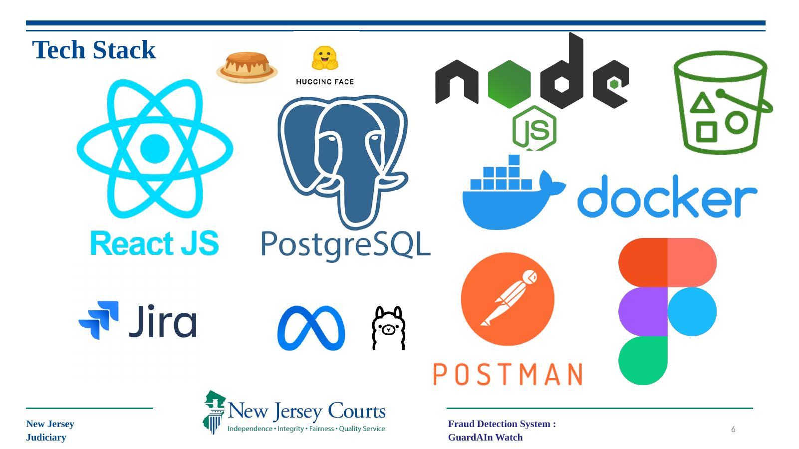
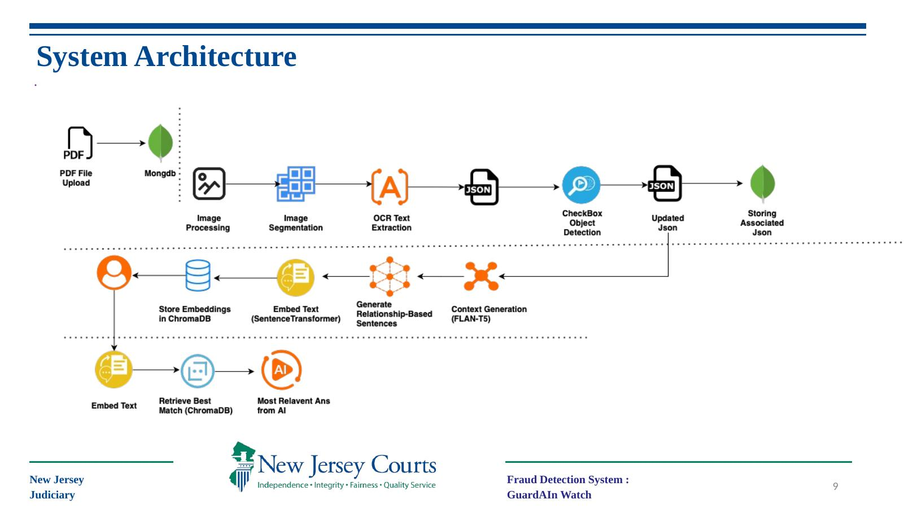

<div align="center">



# GuardAIn Watch
### AI-Based Guardianship Fraud Detection System

*Protecting vulnerable individuals through intelligent document analysis — powered by AI.*

[](https://www.njcourts.gov/)
[](https://react.dev/)
[](https://nodejs.org/)
[](https://ai.meta.com/llama/)
[](https://huggingface.co/)
[](LICENSE)

> **Capstone Project — Spring 2025**
> Developed in partnership with the **New Jersey Judiciary**



</div>

---

## 📋 Table of Contents

- [Overview](#-overview)
- [Background & Problem Statement](#-background--problem-statement)
- [Scope](#-scope)
- [Team](#-team)
- [Tech Stack](#-tech-stack)
- [System Architecture](#-system-architecture)
- [Risks & Mitigation](#-risks--mitigation)
- [Product Demo](#-product-demo)
- [Getting Started](#-getting-started)

---

## 🛡️ Overview

**GuardAIn Watch** is an AI-powered fraud detection system built for the New Jersey Judiciary. It automatically reviews guardianship court documents, identifies inconsistencies, and flags potential fraud — protecting vulnerable individuals who rely on the court's guardianship system.

> *"Detect Fraud and Enforce Integrity — a state-of-the-art fraud detector utilizing machine learning to identify suspicious inconsistencies in guardianship cases."*

---

## 📌 Background & Problem Statement

**The Problem:**

Guardianship court cases are established to protect vulnerable individuals who cannot make informed decisions due to age, mental illness, or disability. However, the system is prone to manipulation — some guardians exploit these cases for personal gain, leading to fraud and abuse.

- 📁 **11,279** guardianship cases filed between 2020–2025
- 💰 **$1.3 Billion** in assets under guardianship management
- ⚠️ Manual review processes make fraud detection slow and inconsistent

**The Solution:**

GuardAIn Watch introduces an advanced fraud detection system that leverages state-of-the-art AI/ML models to scrutinize guardianship forms. Users can securely upload forms online, where the system processes data, compares key information, and flags inconsistencies or unusual patterns indicative of fraud. By automatically classifying potential fraudulent activities, the solution enhances judicial oversight and safeguards vulnerable individuals.

---

## 🎯 Scope

- ✅ Automated document review and fraud detection
- ✅ Machine learning model training and refinement
- ✅ Reporting system for flagged cases
- ✅ Secure API development for future government use

---

## 👥 Team

| Name | Role |
|------|------|
| **Alexandra Drzewosz** | Project Manager |
| **Alvee Jalal** | UI/UX |
| **Anish Panicker** | AI/ML |
| **Karthik Katakam** | AI/ML |
| **Vamsi Kalyan Reddy Ankenapalli** | AI/ML |

*Sponsored by: **New Jersey Courts** — Independence · Integrity · Fairness · Quality Service*

---

## 🛠️ Tech Stack



| Layer | Technology |
|-------|------------|
| **Frontend** | React.js |
| **Backend** | Node.js |
| **Case Database** | PostgreSQL |
| **AI Database** | MongoDB + Amazon S3 |
| **Vector Store** | ChromaDB |
| **AI Models** | Meta LLaMA, FLAN-T5, SentenceTransformer |
| **Model Hub** | Hugging Face |
| **Containerization** | Docker |
| **API Testing** | Postman |
| **UI Prototyping** | Figma |
| **Project Management** | Jira |

---

## 🏗️ System Architecture



The pipeline processes uploaded guardianship PDFs through the following stages:

```
PDF Upload → MongoDB Storage
        ↓
Image Processing → Image Segmentation
        ↓
OCR Text Extraction → JSON Output
        ↓
CheckBox Object Detection → Updated JSON → Storing Associated JSON
        ↓
Context Generation (FLAN-T5) → Relationship-Based Sentences
        ↓
Embed Text (SentenceTransformer) → Store Embeddings in ChromaDB
        ↓
Retrieve Best Match (ChromaDB) → Most Relevant Answer from AI
        ↓
Results returned to user
```

**Key AI Components:**
- **OCR Text Extraction** — Converts scanned document images to structured text
- **FLAN-T5** — Generates contextual understanding of document content
- **SentenceTransformer** — Embeds text for semantic similarity search
- **ChromaDB** — Vector store for retrieving relevant document matches
- **Meta LLaMA** — Final AI reasoning and fraud determination

---

## ⚠️ Risks & Mitigation

| Risk | Mitigation |
|------|------------|
| **False positives / negatives** | Use explainable AI models, allow human review, and continuously update training data to minimize biases |
| **Legal liability for incorrect fraud detection** | Comply with judicial guidelines and establish an independent appeal process for disputed outcomes |
| **Data Privacy Concerns** | Encrypt all stored PDFs and extracted data using AES-256; secure data transfers with TLS |
| **Ethnic bias in fraud detection models** | Use diverse and upsampled datasets to balance representation and reduce bias |
| **Unexpected results** | Developer tools testing, A/B testing, and unit testing |

---

## 💻 Product Demo

The GuardAIn Watch web application features:

- **Home** — Landing page with fraud detection overview
- **Dashboard** — Overview of cases and flagged documents
- **Directory** — Searchable guardian directory
- **Case Listings** — Detailed view of all active cases
- **Document Upload** — Secure PDF upload with AI analysis
- **Notifications** — Real-time alerts for flagged anomalies

---

## 🚀 Getting Started

### Prerequisites

- Node.js 18+
- Python 3.9+
- Docker & Docker Compose
- MongoDB instance
- PostgreSQL instance
- AWS S3 bucket (for document storage)
- Hugging Face API key

### Installation

```bash
# Clone the repository
git clone https://github.com/karthik-katakam/GaurdAIn-AI-Based-Document-Automation.git
cd GaurdAIn-AI-Based-Document-Automation

# Install frontend dependencies
cd frontend
npm install

# Install backend dependencies
cd ../backend
npm install

# Install AI/ML dependencies
cd ../ai
pip install -r requirements.txt
```

### Configuration

```bash
cp .env.example .env
```

```env
# Database
POSTGRES_URL=your_postgres_connection_string
MONGO_URI=your_mongodb_connection_string

# AWS
AWS_ACCESS_KEY_ID=your_access_key
AWS_SECRET_ACCESS_KEY=your_secret_key
AWS_S3_BUCKET=your_bucket_name

# AI
HUGGINGFACE_API_KEY=your_huggingface_key

# Security
AES_SECRET_KEY=your_aes_256_key
```

### Running with Docker

```bash
docker-compose up --build
```

### Running Locally

```bash
# Start backend
cd backend && npm run dev

# Start frontend (new terminal)
cd frontend && npm start

# Start AI service (new terminal)
cd ai && python main.py
```

---

<div align="center">

**GuardAIn Watch** — *New Jersey Judiciary Capstone Project, Spring 2025*

Built with ⚖️ integrity and 🤖 intelligence.

*New Jersey Courts — Independence · Integrity · Fairness · Quality Service*

</div>
